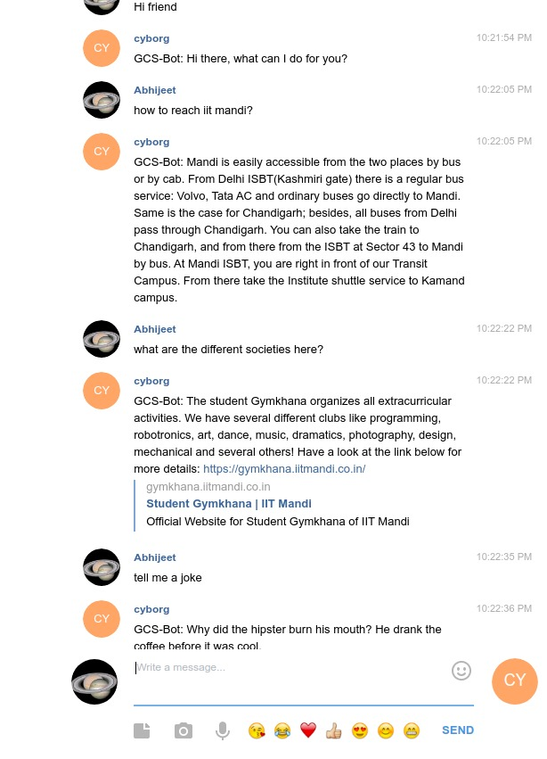

# Cyborg
Cyborg is a telegram chatbot that has been designed to answers queries of the first year students. 

## Usage instructions:

Open telegram and search for @cyborg_gcs_bot.  Here is the direct link : [https://t.me/cyborg_gcs_bot](https://t.me/cyborg_gcs_bot) . 

The bot accepts the following commands:

- **/start** : This starts the bot and it is now ready to receive queries.
- **/help** : Help command

Cyborg is able to answer queries of the following type:

- General : Telling jokes, my age, cheering up the mood!
- GCS : FAQs asked by freshers about various things related to college
- programming : PC club queries, programming errors, suggestions, doubts and any other programming related queries!





## Documentation

### Database

The database is written in a JSON format.  This is how it looks:

```
{
	"intents": [
        {"tag": "greeting",
         "patterns": ["Hi", "Hey", "How are you", "Is anyone there?", "Hello", "Good day", "Whats up"],
         "responses": ["Hello!", "Good to see you again!", "Hi there, how can I help?", "Hello! I'm Dexter. How may I help you?", 						"Hey there!"],
        }
  ]
}
```

Terms used:

- **patterns** : All different queries that a user might enter are put in the "patterns".
- **responses** : After interpreting the user’s query, the chatbot will have to reply to the query and this reply will be randomly selected from the set of predefined replies in **“responses”**
- **tag** : groups a set of similar patterns and responses to a specific category so that it’ll be easier for the model to predict which category a particular pattern represents.